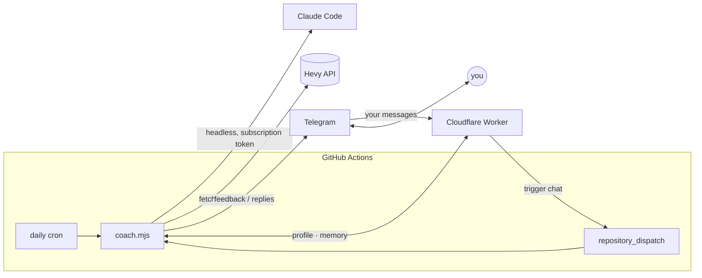

# Hevy AI Coach 🏋️

A personal AI strength coach that lives in your Telegram. Every day it reads
the workout you logged in [Hevy](https://www.hevy.com), analyzes it against
your training plan, injuries, and goals, and messages you real coaching
feedback — and you can message back to discuss diet, volume, future lifts,
anything. Fully automated, runs on your existing Claude subscription, nothing
extra installed on your phone.

I built this because I was doing it manually: every day after the gym I'd
paste my Hevy data into an LLM chat with a long coach prompt. This repo turns
that ritual into infrastructure.

## How it works



The design choice that makes it free: **all reasoning runs inside GitHub
Actions via [Claude Code](https://claude.com/claude-code) headless**,
authenticated with a long-lived token from your Claude subscription — no
pay-as-you-go API key. The Cloudflare Worker never touches Claude; it's just
the always-on front door.

- **GitHub Actions is the brain.** A scheduled job runs [`scripts/coach.mjs`](scripts/coach.mjs)
  once a day: it polls Hevy's [workout events endpoint](https://api.hevyapp.com/docs/)
  with a watermark, compacts new workouts (drops IDs and null fields — fewer
  tokens, same signal), and asks Claude for coach feedback with your full
  context, then sends it to Telegram.
- **Two-way chat.** When you message the bot, the Cloudflare Worker validates
  it's you and fires a `repository_dispatch` that runs the same script in chat
  mode. Replies land in ~1–2 minutes (a fresh Actions runner per message) —
  the trade-off for using your subscription the officially-supported way
  instead of an always-on API key.
- **Memory that scales.** Recent turns are kept verbatim; older turns get
  folded into rolling "case notes" by a cheap summarization call, so the
  prompt never grows unboundedly. Your profile (injuries, goals, medical
  notes) is a separate state key that summarization never touches — only the
  explicit `/remember` command writes to it.

## Privacy by design

This repo is public; your data never is. The code contains only a **generic**
coach persona. Everything personal lives elsewhere:

| What | Where |
|---|---|
| Claude / Hevy / Telegram credentials | GitHub Actions secrets + Worker secrets |
| Medical info, injuries, goals, training plan | Cloudflare KV `profile`, seeded by you |
| Conversation history & coach case notes | Cloudflare KV, written by the Actions job |

Two auth gates protect the bot: Telegram's webhook secret proves requests come
from Telegram, and a hard check on your numeric user ID means the (publicly
discoverable) bot ignores everyone but you.

## Chat commands

| Command | What it does |
|---|---|
| `/last` | Fetch and coach your latest Hevy workout on demand |
| `/weight 82.5` | Log today's bodyweight |
| `/weights` | Show the recent bodyweight log |
| `/remember <fact>` | Save a fact to your permanent profile |
| `/reset` | Clear conversation history (profile and case notes kept) |
| anything else | Talk to your coach |

## Deploy your own (~20 minutes)

**Prereqs:** a Claude Pro/Max subscription, [Hevy Pro](https://www.hevy.com)
(the API is Pro-only), a free [Cloudflare](https://dash.cloudflare.com)
account, Telegram, Node 20+, and the [GitHub CLI](https://cli.github.com).

1. Fork this repo and clone your fork; `npm install`.
2. **Claude subscription token:** install the CLI (`npm i -g @anthropic-ai/claude-code`),
   run `claude setup-token`, authorize in the browser, and copy the
   `sk-ant-oat01-…` token it prints.
3. **Hevy API key:** [hevy.com/settings?developer](https://hevy.com/settings?developer).
4. **Telegram bot:** message [@BotFather](https://t.me/BotFather) → `/newbot` →
   save the token. Message [@userinfobot](https://t.me/userinfobot) for your
   numeric user ID.
5. **Cloudflare:** `npx wrangler login`, then
   `npx wrangler kv namespace create COACH_KV` and paste the `id` into
   `wrangler.toml`. Set `ALLOWED_TELEGRAM_USER_ID` and `GITHUB_REPO` in the
   `[vars]` block.
6. **Worker secrets** (generate the first two with `openssl rand -hex 32`):
   ```sh
   npx wrangler secret put TELEGRAM_WEBHOOK_SECRET
   npx wrangler secret put CRON_SECRET
   npx wrangler secret put GITHUB_TOKEN   # a token with `repo` scope
   ```
7. **Deploy the Worker:** `npx wrangler deploy` → note the
   `https://….workers.dev` URL.
8. **Seed your private profile** — write `my-profile.md` locally (gitignored;
   template in [persona/profile.example.md](persona/profile.example.md)), then:
   ```sh
   curl -X PUT "https://<worker>.workers.dev/state/profile" \
     -H "Authorization: Bearer <CRON_SECRET>" --data-binary @my-profile.md
   ```
9. **Point Telegram at the Worker:**
   ```sh
   curl "https://api.telegram.org/bot<BOT_TOKEN>/setWebhook" \
     -d "url=https://<worker>.workers.dev/telegram" \
     -d "secret_token=<TELEGRAM_WEBHOOK_SECRET>" \
     -d 'allowed_updates=["message"]'
   ```
10. **GitHub Actions secrets** (repo → Settings → Secrets and variables →
    Actions): `CLAUDE_CODE_OAUTH_TOKEN`, `HEVY_API_KEY`, `TELEGRAM_BOT_TOKEN`,
    `TELEGRAM_CHAT_ID` (your user ID), `WORKER_URL`, `CRON_SECRET`. Optionally
    set `CLAUDE_MODEL` / `USER_TIMEZONE` as Actions *variables*.
11. Adjust the cron time in
    [.github/workflows/daily-checkin.yml](.github/workflows/daily-checkin.yml)
    — it's **UTC**.
12. Test: message your bot "hey coach", then run *Daily coach check-in* from
    the Actions tab.

Make the coach yours by editing [persona/coach.md](persona/coach.md).

## Design notes & trade-offs

- **All Claude calls run in GitHub Actions via Claude Code**, the supported way
  to use a subscription in automation — so there's no API-key billing and no
  gray-area use of subscription tokens against the raw API.
- **Chat latency is ~1–2 min** because each message spins up a fresh runner
  that installs Claude Code. The daily check-in (the core feature) doesn't care
  about latency; chat is a bonus. An always-on API key would make chat instant
  but costs money — a deliberate trade.
- **Telegram messages are plain text, chunked at ~3,900 chars** — the API
  hard-limits at 4,096 and MarkdownV2 escaping causes silent 400s, so the
  persona writes without markdown.
- **The webhook returns 200 immediately** and dispatches in `ctx.waitUntil`;
  updates are deduped by `update_id` so Telegram's retries don't double-fire.
- **Failed runs self-heal:** the Hevy watermark and per-workout "seen" markers
  only advance after feedback is delivered, so a flaky day is fixed next run.
- **Known limitation:** GitHub disables cron on public repos after 60 days
  without commits — re-enable in the Actions tab, or move the schedule to a
  [Cloudflare Cron Trigger](https://developers.cloudflare.com/workers/configuration/cron-triggers/).

## Development

```sh
npm test            # vitest unit tests (chunking, workout compaction, event filtering)
npm run typecheck   # tsc --noEmit on the Worker
npm run coach daily # run the coach locally (uses ./.local-state if WORKER_URL is unset)
npm run dev         # local Worker with .dev.vars
```

Run locally with `CLAUDE_CODE_OAUTH_TOKEN`, `HEVY_API_KEY`,
`TELEGRAM_BOT_TOKEN`, and `TELEGRAM_CHAT_ID` in your environment; state falls
back to local JSON files under `.local-state/`.

## License

MIT
