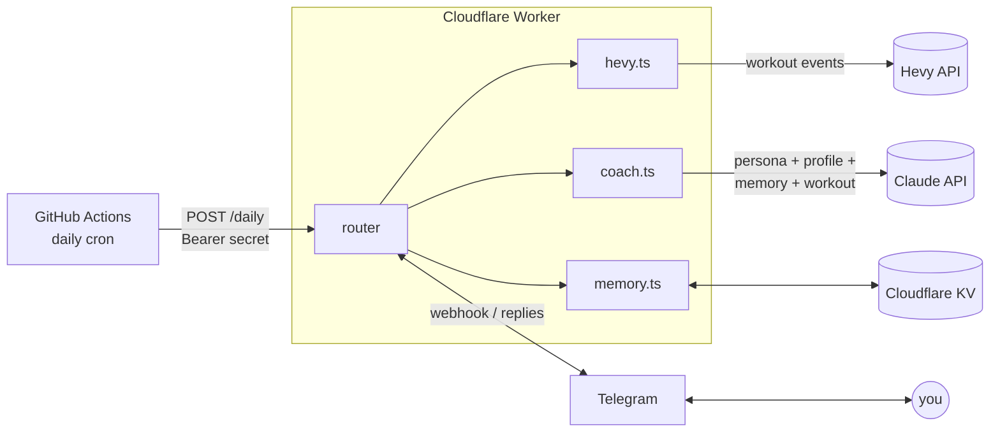

# Hevy AI Coach 🏋️

A personal AI strength coach that lives in your Telegram. Every day it reads
the workout you logged in [Hevy](https://www.hevy.com), analyzes it against
your training plan, injuries, and goals, and messages you real coaching
feedback — and you can message back to discuss diet, volume, future lifts,
anything. Fully automated, $0/month, nothing extra installed on your phone.

I built this because I was doing it manually: every day after the gym I'd
paste my Hevy data into an LLM chat with a long coach prompt. This repo turns
that ritual into infrastructure.

## How it works



- **A single Cloudflare Worker owns all logic.** GitHub Actions is just an
  alarm clock that POSTs to a protected `/daily` endpoint once a day. No
  split-brain state, secrets live in one place, everything fits in free tiers.
- **Daily push:** the Worker polls Hevy's [workout events endpoint](https://api.hevyapp.com/docs/)
  with a watermark, compacts new workouts (drops IDs and null fields — fewer
  tokens, same signal), and asks Claude for coach feedback with full context.
- **Two-way chat:** Telegram webhook → Worker → Claude, with conversation
  memory persisted in KV. Reply to the daily feedback like you would to a
  human coach.
- **Memory that scales:** recent turns are kept verbatim; older turns get
  folded into rolling "case notes" by a cheap summarization call, so the
  prompt never grows unboundedly. Your profile (injuries, goals, medical
  notes) is a separate key that summarization never touches — only the
  explicit `/remember` command writes to it.

## Privacy by design

This repo is public; your data never is. The code contains a **generic** coach
persona. Everything personal lives only in *your* Cloudflare account:

| What | Where |
|---|---|
| API keys | Worker secrets (`wrangler secret put`) |
| Medical info, injuries, goals, training plan | KV `profile` key, seeded by you |
| Conversation history & coach case notes | KV, written by the Worker |

Two auth gates protect the bot: Telegram's webhook secret token proves
requests come from Telegram, and a hard check on your numeric user ID means
the (publicly discoverable) bot ignores everyone but you.

## Chat commands

| Command | What it does |
|---|---|
| `/last` | Fetch and coach your latest Hevy workout on demand |
| `/weight 82.5` | Log today's bodyweight |
| `/weights` | Show the recent bodyweight log |
| `/remember <fact>` | Save a fact to your permanent profile |
| `/reset` | Clear conversation history (profile and case notes kept) |
| anything else | Talk to your coach |

## Deploy your own (~20 minutes)

**Prereqs:** [Hevy Pro](https://www.hevy.com) (the API is Pro-only), a free
[Cloudflare](https://dash.cloudflare.com) account, an
[Anthropic API key](https://console.anthropic.com), Telegram, Node 20+.

1. Fork and clone this repo, then `npm install`.
2. **Hevy API key:** grab it at [hevy.com/settings?developer](https://hevy.com/settings?developer).
3. **Telegram bot:** message [@BotFather](https://t.me/BotFather) → `/newbot` →
   save the bot token. Then message [@userinfobot](https://t.me/userinfobot)
   to get your numeric user ID.
4. **Cloudflare:** `npx wrangler login`, then
   `npx wrangler kv namespace create COACH_KV` and paste the returned `id`
   into `wrangler.toml`.
5. In `wrangler.toml` `[vars]`, set `ALLOWED_TELEGRAM_USER_ID` and
   `TELEGRAM_CHAT_ID` (both = your user ID for a DM bot), your
   `USER_TIMEZONE`, and optionally the model.
6. Set the five secrets (generate the last two with `openssl rand -hex 32`):
   ```sh
   npx wrangler secret put ANTHROPIC_API_KEY
   npx wrangler secret put HEVY_API_KEY
   npx wrangler secret put TELEGRAM_BOT_TOKEN
   npx wrangler secret put TELEGRAM_WEBHOOK_SECRET
   npx wrangler secret put CRON_SECRET
   ```
7. **Seed your private profile** — write `my-profile.md` locally (it's
   gitignored): your goals, training history, injuries, current program,
   anything a coach should know. Then:
   ```sh
   npx wrangler kv key put --binding COACH_KV --remote profile --path my-profile.md
   ```
8. Deploy: `npx wrangler deploy` → note your `https://….workers.dev` URL.
9. Point Telegram at it:
   ```sh
   curl "https://api.telegram.org/bot<BOT_TOKEN>/setWebhook" \
     -d "url=https://<your-worker>.workers.dev/telegram" \
     -d "secret_token=<TELEGRAM_WEBHOOK_SECRET>" \
     -d 'allowed_updates=["message"]'
   ```
10. In your GitHub fork: Settings → Secrets and variables → Actions → add
    `WORKER_URL` (the workers.dev URL, no trailing slash) and `CRON_SECRET`.
11. Adjust the cron time in
    [.github/workflows/daily-checkin.yml](.github/workflows/daily-checkin.yml)
    — it's **UTC**, pick a time comfortably after your usual workout.
12. Test: message your bot "hey coach", then run the *Daily coach check-in*
    workflow manually from the Actions tab.

Make the coach yours by editing [persona/coach.md](persona/coach.md).

## Design notes & trade-offs

- **Telegram messages are plain text, chunked at ~3,900 chars** — the API
  hard-limits at 4,096, and MarkdownV2 escaping is a notorious source of
  silent 400s, so the persona is instructed to write without markdown.
- **The webhook returns 200 immediately** and does the LLM call in
  `ctx.waitUntil` — Telegram retries slow webhooks, which would double-process
  messages. Updates are also deduped by `update_id` in KV.
- **Failed runs self-heal:** the Hevy watermark and per-workout "seen" markers
  only advance after feedback is actually delivered, so a flaky day is fixed
  by the next cron tick.
- **KV's eventual consistency** (~60s cross-edge) is a deliberate trade-off:
  for a single user chatting from one phone it's a non-issue, and it keeps the
  whole thing on the free tier. A multi-user version would use Durable Objects.
- **Known limitation:** GitHub disables cron schedules on public repos after
  60 days without commits — re-enable in the Actions tab, or switch to a
  [Cloudflare Cron Trigger](https://developers.cloudflare.com/workers/configuration/cron-triggers/)
  (one line in `wrangler.toml`) if you'd rather not think about it.

## Development

```sh
npm test            # vitest unit tests (chunking, workout compaction, event filtering)
npm run typecheck   # tsc --noEmit
npm run dev         # local worker with .dev.vars (copy .dev.vars.example)
npm run tail        # live logs from the deployed worker
```

## License

MIT
